<p align="center">
  
</p>

<h1 align="center">
  <code>GRAVITY-</code>
</h1>

<p align="center">
  <strong>Forensic Research Aggregation & Epistemic Intelligence System</strong>
</p>

<p align="center">
  
  
  
  
  
  
  
  
  
</p>

<p align="center">
  <em>A seven-phase forensic research operating system that collects, correlates, scores, and tracks<br/>publicly available information with cryptographic integrity and blockchain anchoring guarantees.</em>
</p>

<p align="center">
  <sub>The system does not confirm or deny claims. It gathers, organizes, correlates, scores, and tracks data.</sub>
</p>

---

## Case File

> **Project Anchor — August 12 Gravity Event — Thomas Webb**

---

## Table of Contents

> Color key: 🟦 Architecture &nbsp; 🟩 Phases &nbsp; 🟧 CLI &nbsp; 🟪 Data &nbsp; 🟥 Technical &nbsp; ⬜ Operations

| # | Section | Category | Description |
|:-:|---------|:--------:|-------------|
| 1 | [System Architecture](#-system-architecture) | 🟦 | High-level design, data flow, phase pipeline |
| 2 | [Phase Pipeline Overview](#-phase-pipeline-overview) | 🟦 | Phase dependency graph and capability matrix |
| 3 | [Repository Structure](#-repository-structure) | 🟦 | Complete file tree (36 modules, 6 test suites) |
| 4 | [Phase I — Research & Collection](#-phase-i--research--collection) | 🟩 | Data scraping, PDF analysis, physics, NLP, IPFS |
| 5 | [Phase II — Cryptographic Integrity](#-phase-ii--cryptographic-integrity) | 🟩 | Ed25519, Merkle trees, FOIA, audit reports |
| 6 | [Phase III — Mathematical Framework](#-phase-iii--mathematical-framework) | 🟩 | Equation parsing, dimensional analysis, claim graph |
| 7 | [Phase IV — Quantitative Scoring](#-phase-iv--quantitative-scoring) | 🟩 | Bayesian confidence, entropy, citation density |
| 8 | [Phase V — Temporal Dynamics](#-phase-v--temporal-dynamics) | 🟩 | Timelines, drift kinematics, stability, alerts |
| 9 | [Phase VI — Source Intelligence](#-phase-vi--source-intelligence--network-forensics) | 🟩 | Reputation, influence, coordination, provenance |
| 10 | [Phase VII — Scientific Optimization](#-phase-vii--scientific-optimization--blockchain-anchoring) | 🟩 | Math analysis, Rust contracts, blockchain anchoring |
| 11 | [CLI Command Reference](#-cli-command-reference) | 🟧 | All 87 commands organized by phase |
| 12 | [Database Schema](#-database-schema) | 🟪 | 39 tables across 7 phases |
| 12 | [Scoring & Algorithm Reference](#-scoring--algorithm-reference) | 🟥 | Mathematical formulas, weights, thresholds |
| 13 | [Flow Diagrams](#-flow-diagrams) | 🟥 | Data pipeline, scoring cascade, alert flow |
| 15 | [Testing](#-testing) | ⬜ | 390 tests, per-phase breakdown |
| 15 | [IPFS Integration](#-ipfs-integration) | ⬜ | Proof chain, pinning, IPNS workflow |
| 16 | [Operational Scope & Reproducibility](#-operational-scope--reproducibility) | ⬜ | Legal boundaries, audit trail, portability |
| 17 | [Quick Start](#-quick-start) | ⬜ | Installation and first run |
| 18 | [Dependencies](#-dependencies) | ⬜ | Required packages and versions |

---

## 🟦 System Architecture

```mermaid
graph TB
    subgraph INPUT["📥 DATA SOURCES"]
        direction LR
        R[Reddit / Social]
        W[Wayback Machine]
        G[Gov Records]
        A[Academic DBs]
        P[PDF Documents]
        F[FOIA Documents]
    end

    subgraph PHASE1["🟢 PHASE I — Collection"]
        direction LR
        SC[Scrapers]
        PA[PDF Analyzer]
        PE[Physics Engine]
        NLP[NLP Analyzer]
    end

    subgraph PHASE2["🔵 PHASE II — Integrity"]
        direction LR
        CR[Ed25519 Crypto]
        MK[Merkle Trees]
        FO[FOIA Forensics]
        AU[Audit Reports]
    end

    subgraph PHASE3["🟡 PHASE III — Math"]
        direction LR
        EQ[Equation Parser]
        DA[Dim. Analysis]
        CG[Claim Graph]
        SY[SymPy CAS]
    end

    subgraph PHASE4["🟠 PHASE IV — Scoring"]
        direction LR
        BC[Bayesian Scorer]
        ME[Mutation Entropy]
        CD[Citation Density]
        CA[Contradictions]
    end

    subgraph PHASE5["🔴 PHASE V — Temporal"]
        direction LR
        CT[Conf. Timeline]
        ET[Entropy Trend]
        DK[Drift Kinem.]
        AL[Alert Engine]
    end

    subgraph PHASE6["🟣 PHASE VI — Intelligence"]
        direction LR
        SR[Source Reputation]
        IN[Influence Network]
        CO[Coordination Det.]
        DP[Deep Provenance]
    end

    subgraph PHASE7["⚪ PHASE VII — Scientific Optimization"]
        direction LR
        MF[Missing Factors]
        SA[Stability Analysis]
        FP[Formal Proofs]
        BA[Blockchain Anchors]
    end

    subgraph STORAGE["💾 STORAGE LAYER"]
        DB[(SQLite<br/>39 Tables)]
        IPFS[(IPFS<br/>Proof Chain)]
        LOG[Logs]
        CHAIN[(Blockchain<br/>Anchors)]
    end

    subgraph OUTPUT["📤 OUTPUT"]
        RPT[Reports]
        CLI[CLI / 87 Commands]
        DASH[Dashboard]
    end

    INPUT --> PHASE1
    PHASE1 --> PHASE2
    PHASE2 --> PHASE3
    PHASE3 --> PHASE4
    PHASE4 --> PHASE5
    PHASE5 --> PHASE6
    PHASE6 --> PHASE7

    PHASE1 --> STORAGE
    PHASE2 --> STORAGE
    PHASE3 --> STORAGE
    PHASE4 --> STORAGE
    PHASE5 --> STORAGE
    PHASE6 --> STORAGE
    PHASE7 --> STORAGE

    STORAGE --> OUTPUT

    style INPUT fill:#1a1a2e,stroke:#58a6ff,color:#c9d1d9
    style PHASE1 fill:#0d2818,stroke:#2ea043,color:#c9d1d9
    style PHASE2 fill:#0d1b2e,stroke:#58a6ff,color:#c9d1d9
    style PHASE3 fill:#2e2a0d,stroke:#d29922,color:#c9d1d9
    style PHASE4 fill:#2e1a0d,stroke:#f0883e,color:#c9d1d9
    style PHASE5 fill:#2e0d0d,stroke:#f85149,color:#c9d1d9
    style PHASE6 fill:#1f0d2e,stroke:#a371f7,color:#c9d1d9
    style PHASE7 fill:#1a1a1a,stroke:#8b949e,color:#c9d1d9
    style STORAGE fill:#161b22,stroke:#8b949e,color:#c9d1d9
    style OUTPUT fill:#0d1117,stroke:#58a6ff,color:#c9d1d9
```

---

## 🟦 Phase Pipeline Overview

### Capability Matrix

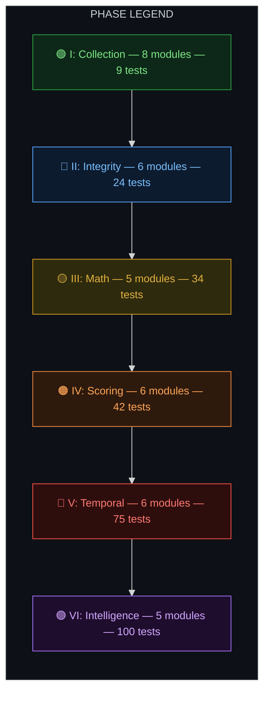

### Phase Statistics

| Phase | Color | Name | Modules | Tests | Tables | CLI Commands |
|:-----:|:-----:|------|:-------:|:-----:|:------:|:------------:|
| **I** | 🟢 | Research & Collection | 8 | 9 | 9 | 21 |
| **II** | 🔵 | Cryptographic Integrity | 6 | 24 | 7 | 12 |
| **III** | 🟡 | Mathematical Framework | 5 | 34 | 6 | 11 |
| **IV** | 🟠 | Quantitative Scoring | 6 | 42 | 3 | 8 |
| **V** | 🔴 | Temporal Dynamics | 6 | 75 | 4 | 11 |
| **VI** | 🟣 | Source Intelligence | 5 | 100 | 4 | 11 |
| | | **TOTALS** | **36** | **284** | **33** | **77** |

### Phase Dependency Flow

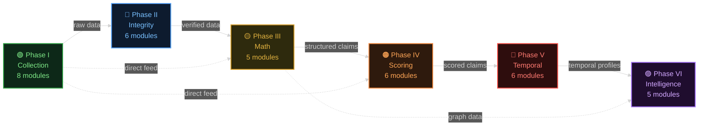

---

## 🟦 Repository Structure

```
project-anchor-research/
├── main.py                              # CLI orchestrator (77 commands)
├── requirements.txt                     # Python dependencies
├── README.md
├── data/                                # SQLite DB, keys, downloaded files
│   └── keys/                            # Ed25519 signing keypairs
├── logs/                                # Timestamped operation logs
├── reports/                             # Generated reports
│   └── audits/                          # Audit reports (JSON, HTML, Markdown)
│
├── src/
│   ├── config.py                        # Configuration & constants
│   ├── database.py                      # SQLite schema (33 tables) & helpers
│   ├── logger.py                        # Structured logging
│   │
│   ├── collectors/                      # 🟢 Phase I — Data collection
│   │   ├── base_scraper.py              #   Abstract base with rate limiting
│   │   ├── reddit_scraper.py            #   Reddit JSON endpoint scraper
│   │   ├── wayback_scraper.py           #   Internet Archive CDX API
│   │   └── web_search_scraper.py        #   DuckDuckGo HTML scraper
│   │
│   ├── analyzers/                       # 🟢 Phase I — Document analysis
│   │   └── pdf_analyzer.py              #   PDF metadata, fonts, markings
│   │
│   ├── crossref/                        # 🟢 Phase I — External databases
│   │   ├── academic_records.py          #   CrossRef, Semantic Scholar, OpenAlex
│   │   ├── government_records.py        #   NASA NTRS, FOIA.gov, FPDS
│   │   └── research_sources.py          #   Extended source search
│   │
│   ├── physics/                         # 🟢 Phase I — Physics verification
│   │   ├── gravity_engine.py            #   Gravitational physics computations
│   │   └── wave_engine.py               #   Wave science computations
│   │
│   ├── nlp/                             # 🟢 Phase I — Narrative analysis
│   │   └── narrative_analyzer.py        #   Pattern detection & similarity
│   │
│   ├── ipfs/                            # 🟢 Phase I — Immutable storage
│   │   ├── ipfs_client.py               #   Kubo RPC API client
│   │   ├── proof_chain.py               #   DAG-linked evidence chain
│   │   ├── evidence_archiver.py         #   Orchestrates pinning to IPFS
│   │   ├── ipns_publisher.py            #   IPNS name publishing
│   │   └── multi_gateway.py             #   Multi-gateway health & pinning
│   │
│   ├── dashboard/                       # 🟢 Phase I — Visualization
│   │   └── dashboard.py                 #   Plotly/Dash interactive dashboard
│   │
│   ├── crypto/                          # 🔵 Phase II — Cryptographic integrity
│   │   └── signature_manager.py         #   Ed25519 keypair & CID signing
│   │
│   ├── proofs/                          # 🔵 Phase II — Merkle verification
│   │   └── merkle_snapshot.py           #   Merkle tree snapshots of DB state
│   │
│   ├── foia/                            # 🔵 Phase II — FOIA forensics
│   │   ├── foia_ingester.py             #   FOIA document ingestion
│   │   └── document_forensics.py        #   Document authenticity scoring
│   │
│   ├── investigations/                  # 🔵 Phase II — Case databases
│   │   ├── scientist_cases.py           #   Historical scientist cases DB
│   │   └── tesla_module.py              #   Tesla investigation module
│   │
│   ├── reports/                         # 🔵 Phase II — Audit reports
│   │   └── audit_generator.py           #   Comprehensive audit report gen
│   │
│   ├── taxonomy/                        # 🔵 Phase II — Knowledge base
│   │   └── knowledge_base.py            #   Taxonomy classification system
│   │
│   ├── math/                            # 🟡 Phase III — Mathematical framework
│   │   ├── equation_parser.py           #   Plaintext & LaTeX → SymPy AST
│   │   ├── dimensional_analyzer.py      #   Dimensional consistency checking
│   │   ├── symbolic_refactor.py         #   CAS: simplify, factor, diff
│   │   ├── derivation_logger.py         #   Step-by-step derivation chains
│   │   └── equation_audit_report.py     #   Math forensics audit reports
│   │
│   └── graph/                           # 🟡🟠🔴🟣 Phases III–VI
│       ├── claim_graph.py               #   🟡 III: Typed claim/source/entity graph
│       ├── propagation_graph.py         #   🟡 III: NetworkX propagation mapping
│       ├── confidence_scorer.py         #   🟠 IV: Bayesian 6-component scoring
│       ├── mutation_entropy.py          #   🟠 IV: Shannon entropy of mutations
│       ├── citation_density.py          #   🟠 IV: Cross-reference density scoring
│       ├── contradiction_analyzer.py    #   🟠 IV: Tension mapping & conflict clusters
│       ├── propagation_tracker.py       #   🟠 IV: Event velocity & amplification
│       ├── claim_scoring_report.py      #   🟠 IV: Aggregate epistemic reports
│       ├── confidence_timeline.py       #   🔴 V: Temporal confidence tracking
│       ├── entropy_trend.py             #   🔴 V: H(t) series, dH/dt, d²H/dt²
│       ├── drift_kinematics.py          #   🔴 V: Velocity, acceleration, jerk
│       ├── stability_classifier.py      #   🔴 V: 5-state epistemic classifier
│       ├── alert_engine.py              #   🔴 V: Rule-based anomaly detection
│       ├── lifecycle_report.py          #   🔴 V: 10-section lifecycle reports
│       ├── source_reputation.py         #   🟣 VI: EMA credibility tracking
│       ├── influence_network.py         #   🟣 VI: Source amplification graphs
│       ├── coordination_detector.py     #   🟣 VI: Temporal clustering detection
│       ├── provenance_deep.py           #   🟣 VI: Multi-layer origin tracing
│       └── source_forensics_report.py   #   🟣 VI: Comprehensive intelligence reports
│
└── tests/
    ├── test_physics.py                  # 🟢   9 tests — Physics engine
    ├── test_phase2.py                   # 🔵  24 tests — Crypto & integrity
    ├── test_phase3.py                   # 🟡  34 tests — Math & claim graph
    ├── test_phase4.py                   # 🟠  42 tests — Scoring engine
    ├── test_phase5.py                   # 🔴  75 tests — Temporal dynamics
    └── test_phase6.py                   # 🟣 100 tests — Source intelligence
```

---

## 🟩 Phase I — Research & Collection

> 🟢 **Core data gathering and analysis layer**

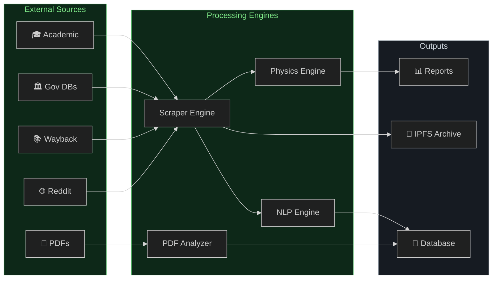

| # | Module | Description |
|:-:|--------|-------------|
| 1 | **Data Collection** | Scrapes Reddit, Wayback Machine, web search for earliest references |
| 2 | **Document Analysis** | PDF metadata extraction, font analysis, classification marking detection |
| 3 | **Origin Trace** | Identifies earliest indexed references, maps repost sequences |
| 4 | **Government Cross-Ref** | Searches NASA NTRS, FOIA.gov, FPDS, USASpending |
| 5 | **Academic Verification** | Searches CrossRef, Semantic Scholar, OpenAlex |
| 6 | **Physics Consistency** | GW strain, binding energy, tidal forces, merger energetics |
| 7 | **Narrative Analysis** | Detects whistleblower/disappearance/urgency patterns via NLP |
| 8 | **IPFS Evidence Archive** | Immutable, content-addressed proof chain on IPFS |

---

## 🟩 Phase II — Cryptographic Integrity

> 🔵 **Tamper-proof evidence anchoring and expanded research capabilities**

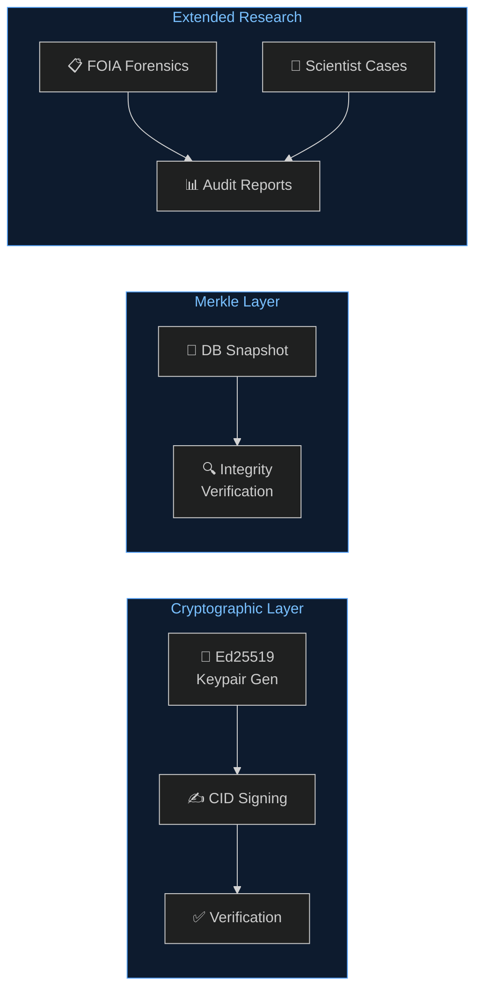

| # | Module | Description |
|:-:|--------|-------------|
| 9 | **Ed25519 Signatures** | Generate keypairs, sign CIDs, verify signatures |
| 10 | **Merkle Snapshots** | Hash entire DB state into Merkle tree, verify integrity |
| 11 | **FOIA Forensics** | Document authenticity scoring and classification detection |
| 12 | **Scientist Cases DB** | Historical cases of suppressed/disputed scientists |
| 13 | **Audit Reports** | Comprehensive HTML/JSON/Markdown audit generation |
| 14 | **Taxonomy Knowledge Base** | Classification system for organizing research categories |

---

## 🟩 Phase III — Mathematical Framework

> 🟡 **Symbolic computation and structured evidence graph**

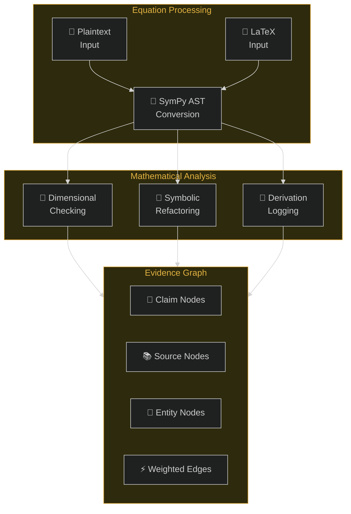

| # | Module | Description |
|:-:|--------|-------------|
| 15 | **Equation Parser** | Plaintext & LaTeX → SymPy AST with SHA-256 fingerprints |
| 16 | **Dimensional Analyzer** | Verify dimensional consistency of physics equations |
| 17 | **Symbolic Refactor** | CAS operations: simplify, factor, expand, differentiate, series |
| 18 | **Derivation Logger** | Step-by-step mathematical derivation chains with persistence |
| 19 | **Claim Graph** | Typed nodes (claims, sources, entities) with weighted edges |

---

## 🟩 Phase IV — Quantitative Scoring

> 🟠 **Bayesian scoring engine and quantitative analysis**

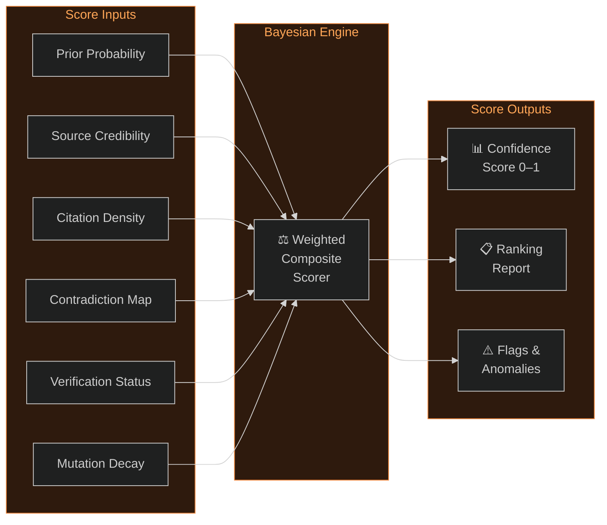

| # | Module | Description |
|:-:|--------|-------------|
| 20 | **Confidence Scorer** | 6-component Bayesian scoring: prior, credibility, citation, contradiction, verification, mutation decay |
| 21 | **Mutation Entropy** | Shannon entropy of claim text mutations, drift velocity, semantic stability |
| 22 | **Citation Density** | Cross-reference density scoring with quality weighting |
| 23 | **Contradiction Analyzer** | Tension mapping, conflict cluster detection (union-find), contested claim identification |
| 24 | **Propagation Tracker** | Event logging, propagation velocity, cascade depth, amplification factor |
| 25 | **Scoring Reports** | Aggregate epistemic reports with integrity scores and rankings |

---

## 🟩 Phase V — Temporal Dynamics

> 🔴 **Temporal tracking, kinematic analysis, stability classification, and alerting**

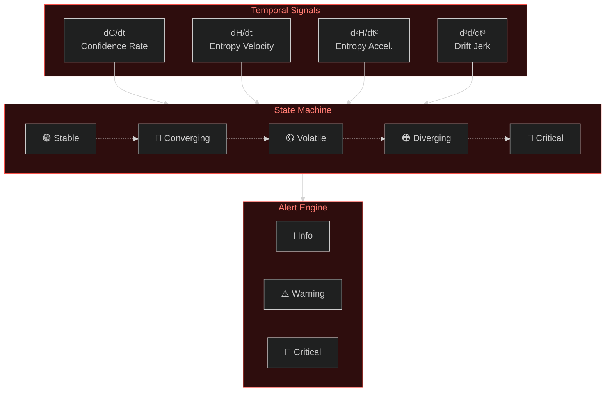

| # | Module | Description |
|:-:|--------|-------------|
| 26 | **Confidence Timeline** | Temporal confidence tracking with SMA/EMA, plateau detection, convergence analysis, dC/dt |
| 27 | **Entropy Trend** | H(t) time series, first derivative dH/dt, second derivative d²H/dt², spike/collapse detection |
| 28 | **Drift Kinematics** | Velocity dd/dt, acceleration d²d/dt², jerk d³d/dt³, inflection point detection, kinematic phase classification |
| 29 | **Stability Classifier** | 5-state epistemic state machine: stable → converging → volatile → diverging → critical |
| 30 | **Alert Engine** | Rule-based anomaly detection across 9 alert types (entropy spike, confidence collapse, drift acceleration, tension surge, etc.) |
| 31 | **Lifecycle Report** | 10-section narrative report with trajectory scoring (0–100%), grade scale (A–F), actionable recommendations |

---

## 🟩 Phase VI — Source Intelligence & Network Forensics

> 🟣 **Source-level credibility tracking, influence network analysis, coordination detection, and deep provenance tracing**

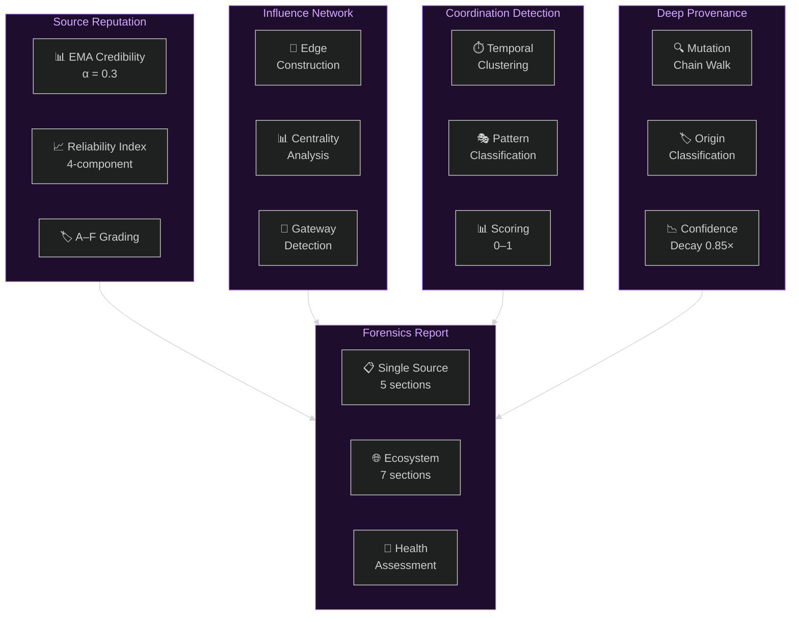

| # | Module | Description |
|:-:|--------|-------------|
| 32 | **Source Reputation** | EMA credibility tracking, Laplace-smoothed reliability, 4-component reliability index, A–F grading, trend direction |
| 33 | **Influence Network** | Source-to-source amplification edges, NetworkX centrality analysis, gateway/bottleneck detection, PageRank |
| 34 | **Coordination Detector** | Temporal burst/cascade/simultaneous pattern detection, sliding window clustering, coordination scoring |
| 35 | **Deep Provenance** | Mutation chain + source chain traversal, origin classification (original/derived/mutated/amplified/orphan), confidence decay |
| 36 | **Source Forensics Report** | 7-section ecosystem reports, single-source intelligence reports, ecosystem health assessment, quick summaries |

---

## � Phase VII — Scientific Optimization & Blockchain Anchoring

> Advanced mathematical analysis, formal proof generation, Rust smart contracts, and deterministic on-chain anchoring.

```mermaid
%%{init: {'theme': 'dark'}}%%
graph LR
    subgraph MATH["⚪ Mathematical Expansion"]
        MFD[Missing Factor<br/>Detector]
        SO[Solution<br/>Optimizer]
        SA[Stability<br/>Analyzer]
        CRM[Canonical<br/>Reference Map]
        FPE[Formal Proof<br/>Exporter]
    end

    subgraph OPT["⚪ Optimization Metrics"]
        SI[Solvability<br/>Index]
        MES[Model Efficiency<br/>Score]
        CR[Compression<br/>Ratio]
    end

    subgraph PERF["⚪ Performance"]
        AE[Async<br/>Executor]
        CM[Cache<br/>Manager]
        BS[Benchmark<br/>Suite]
    end

    subgraph CHAIN["⚪ Blockchain"]
        RAB[Rust Anchor<br/>Bridge]
        RC[Rust Smart<br/>Contracts]
        REG[Scientific<br/>Registry]
    end

    MATH --> OPT
    OPT --> CHAIN
    PERF --> MATH
    CHAIN --> DB[(SQLite + Chain)]

    style MATH fill:#1a1a1a,stroke:#8b949e,color:#c9d1d9
    style OPT fill:#1a1a1a,stroke:#8b949e,color:#c9d1d9
    style PERF fill:#1a1a1a,stroke:#8b949e,color:#c9d1d9
    style CHAIN fill:#1a1a1a,stroke:#8b949e,color:#c9d1d9
```

| # | Module | Description |
|:-:|--------|-------------|
| 37 | **Missing Factor Detector** | Detects omitted physical constants (G, c, ℏ, k_B), dimensional inconsistencies, implicit unit assumptions, canonical deviations |
| 38 | **Solution Optimizer** | 8-strategy simplification (expand, factor, cancel, trigsimp…), compression ratio, overparameterization detection |
| 39 | **Stability Analyzer** | Jacobian computation, eigenvalue extraction, Lyapunov exponents, stability classification (7 classes) |
| 40 | **Canonical Reference Map** | 15 canonical equations (Newton → Boltzmann), structural/algebraic comparison, closest-match finder |
| 41 | **Formal Proof Exporter** | Step-by-step proof trees, SMT-LIB 2.0 export (QF_NRA logic), axiom tracking, DB persistence |
| 42 | **Scientific Registry** | 12 default contributors (Newton → Coulomb), domain filtering, equation/claim linking, SHA-256 hashing |
| 43 | **Solvability Index** | Formula: SI = C/(V+1) × (1-S) × D, stability class mapping, tractability interpretation |
| 44 | **Model Efficiency Score** | Operation count, AST depth, parameter count, normalized cost, efficiency scoring |
| 45 | **Compression Ratio** | Multi-strategy comparison, best strategy selection, equivalence verification |
| 46 | **Async Executor** | ThreadPoolExecutor batch processing, deterministic result ordering, error isolation |
| 47 | **Cache Manager** | SHA-256 keyed LRU cache, TTL expiry, deterministic invalidation, hit/miss statistics |
| 48 | **Benchmark Suite** | Context-manager timing, psutil memory/CPU tracking, JSON log export, DB persistence |
| 49 | **Rust Anchor Bridge** | Payloads for merkle_root/claim_score/equation_proof, dry-run mode, receipt verification |
| 50 | **Rust Smart Contracts** | CosmWasm-compatible contracts: anchor_registry, merkle_anchor, claim_score_anchor, equation_proof_anchor |

---

## 🟧 CLI Command Reference

> **87 commands** across 7 phases. All invoked via `python main.py`.

<details>
<summary><strong>🟢 Phase I — Research & Collection (21 commands)</strong></summary>

```bash
python main.py --collect              # Scrape social media / web
python main.py --academic             # Search academic databases
python main.py --government           # Search government records
python main.py --analyze-pdf FILE     # Analyze a specific PDF
python main.py --physics              # Run physics computations
python main.py --waves                # Run wave science computations
python main.py --nlp                  # Run narrative NLP analysis
python main.py --graph                # Build propagation graph
python main.py --report               # Generate JSON reports
python main.py --static-report        # Generate HTML report
python main.py --dashboard            # Launch interactive dashboard

# IPFS commands (requires local Kubo node):
python main.py --ipfs-status          # Show IPFS node status
python main.py --ipfs-archive         # Archive all evidence to IPFS
python main.py --ipfs-pin FILE        # Pin a specific file
python main.py --ipfs-verify          # Verify proof chain integrity
python main.py --gateway-health       # Check multi-gateway health

# Extended research:
python main.py --taxonomy             # Load taxonomy knowledge base
python main.py --taxonomy-search TERM # Search taxonomy entries
python main.py --taxonomy-export      # Export taxonomy to JSON
python main.py --arxiv TERM           # Search arXiv
python main.py --extended-search      # Run all extended terms
```

</details>

<details>
<summary><strong>🔵 Phase II — Cryptographic Integrity (12 commands)</strong></summary>

```bash
python main.py --key-generate         # Generate Ed25519 signing keypair
python main.py --sign-cid CID        # Sign a CID with default key
python main.py --verify-cid CID      # Verify a CID signature
python main.py --snapshot             # Create Merkle snapshot of database
python main.py --verify-snapshot      # Verify latest Merkle snapshot
python main.py --ipns-publish CID    # Publish CID to IPNS
python main.py --ipns-resolve         # Resolve current IPNS pointer
python main.py --generate-audit       # Generate comprehensive audit report
python main.py --foia-search QUERY   # Search all FOIA sources
python main.py --tesla                # Run Tesla investigation
python main.py --load-scientists      # Load scientist cases database
python main.py --search-scientists Q  # Search scientist cases
```

</details>

<details>
<summary><strong>🟡 Phase III — Mathematical Framework (11 commands)</strong></summary>

```bash
python main.py --parse-equation 'E = m*c**2'   # Parse plaintext equation
python main.py --parse-latex '\frac{1}{2}mv^2'  # Parse LaTeX equation
python main.py --dim-check newton_gravity       # Dimensional analysis
python main.py --simplify-eq 'x**2 + 2*x + 1'  # Simplify expression
python main.py --math-audit                     # Full math forensics audit

python main.py --add-claim "claim text"         # Add claim to graph
python main.py --add-source "source title"      # Add source node
python main.py --link-claim 'cid,sid,supports'  # Link claim to source
python main.py --claim-stats                    # Show graph statistics
python main.py --provenance ID                  # Show claim provenance chain
python main.py --contradictions                 # List all contradictions
```

</details>

<details>
<summary><strong>🟠 Phase IV — Quantitative Scoring (8 commands)</strong></summary>

```bash
python main.py --score-claim ID       # Bayesian confidence score
python main.py --score-all            # Score all claims, rank results
python main.py --mutation-entropy ID  # Mutation entropy analysis
python main.py --citation-density ID  # Citation density analysis
python main.py --tension-map          # Show contradiction tension map
python main.py --propagation ID       # Track propagation velocity
python main.py --claim-report [ID]    # Full epistemic scoring report
python main.py --quick-score ID       # One-line epistemic summary
```

</details>

<details>
<summary><strong>🔴 Phase V — Temporal Dynamics (11 commands)</strong></summary>

```bash
python main.py --conf-snapshot [ID]        # Snapshot confidence (0=all)
python main.py --conf-trend ID             # Confidence trend analysis
python main.py --entropy-snapshot [ID]     # Snapshot entropy (0=all)
python main.py --entropy-trend ID          # Entropy trend analysis
python main.py --drift-kinematics ID       # Drift kinematics analysis
python main.py --classify-claim ID         # Classify stability state
python main.py --classify-all              # Classify all claims
python main.py --alert-scan [ID]           # Scan for anomaly alerts (0=all)
python main.py --alert-list                # List pending alerts
python main.py --lifecycle [ID]            # Lifecycle report (0=system)
python main.py --quick-lifecycle ID        # One-line lifecycle summary
```

</details>

<details>
<summary><strong>🟣 Phase VI — Source Intelligence (11 commands)</strong></summary>

```bash
python main.py --source-snapshot [ID]      # Snapshot source reputation (0=all)
python main.py --source-profile ID         # Full reputation profile
python main.py --source-rank               # Rank all sources by reliability
python main.py --influence-build           # Build source influence edges
python main.py --influence-network         # Analyze the influence network
python main.py --coord-scan [WINDOW]       # Scan for coordination (default: 24h)
python main.py --coord-summary             # Coordination detection summary
python main.py --provenance-trace [ID]     # Deep provenance trace (0=all)
python main.py --provenance-summary        # Deep provenance summary
python main.py --source-report [ID]        # Source forensics report (0=ecosystem)
python main.py --quick-source ID           # One-line source intelligence summary
```

</details>

<details>
<summary><strong>⚪ Phase VII — Scientific Optimization & Blockchain (10 commands)</strong></summary>

```bash
python main.py --detect-missing 'm*c**2'        # Detect missing factors in equation
python main.py --optimize-equation 'x**2+2*x+1' # Optimize / simplify equation
python main.py --stability-analysis '-x,-2*y'   # Stability analysis (comma-sep system)
python main.py --formal-proof 'm*c**2'           # Generate formal proof tree + SMT-LIB
python main.py --solvability 'm*c**2'            # Compute solvability index
python main.py --efficiency-score 'G*m1*m2/r**2' # Compute model efficiency score
python main.py --scientist-link 'Newton,42'      # Link scientist to claim ID
python main.py --anchor-root HASH                # Anchor Merkle root to blockchain
python main.py --anchor-equation 'm*c**2'        # Anchor equation proof to blockchain
python main.py --benchmark                       # Run performance benchmarks
```

</details>

---

## 🟪 Database Schema

> **39 tables** in SQLite WAL mode at `data/project_anchor.db`

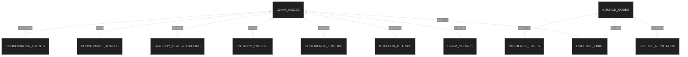

<details>
<summary><strong>🟢 Phase I — Collection & Archive (9 tables)</strong></summary>

| Table | Content |
|-------|---------|
| `social_posts` | Scraped social media posts |
| `documents` | PDF analysis results |
| `academic_records` | Publication search results |
| `government_records` | Public record query results |
| `propagation_edges` | Information spread graph |
| `physics_comparisons` | Computed physics values |
| `narrative_patterns` | NLP analysis results |
| `ipfs_evidence` | IPFS-pinned evidence CIDs & proof chain |
| `taxonomy_entries` | Taxonomy knowledge base entries |

</details>

<details>
<summary><strong>🔵 Phase II — Integrity & Research (7 tables)</strong></summary>

| Table | Content |
|-------|---------|
| `crypto_keys` | Ed25519 signing keypair metadata |
| `merkle_snapshots` | Merkle tree snapshot records |
| `foia_documents` | FOIA document records |
| `investigation_cases` | Investigation case records |
| `case_claims` | Claims linked to investigation cases |
| `scientist_cases` | Historical scientist case records |
| `audit_logs` | Audit trail entries |

</details>

<details>
<summary><strong>🟡 Phase III — Mathematical & Graph (6 tables)</strong></summary>

| Table | Content |
|-------|---------|
| `equation_proofs` | Parsed equation metadata & hashes |
| `derivation_steps` | Step-by-step derivation chain records |
| `claim_nodes` | Typed claim nodes in evidence graph |
| `source_nodes` | Source nodes (documents, academic, social) |
| `evidence_links` | Weighted edges between nodes |
| `entity_nodes` | Person/organization entity nodes |

</details>

<details>
<summary><strong>🟠 Phase IV — Scoring (3 tables)</strong></summary>

| Table | Content |
|-------|---------|
| `claim_scores` | Bayesian confidence score breakdowns |
| `mutation_metrics` | Shannon entropy & drift velocity metrics |
| `propagation_events` | Propagation event log (platform, reach, timestamp) |

</details>

<details>
<summary><strong>🔴 Phase V — Temporal Dynamics (4 tables)</strong></summary>

| Table | Content |
|-------|---------|
| `confidence_timeline` | Confidence score snapshots over time |
| `entropy_timeline` | Shannon entropy snapshots over time |
| `stability_classifications` | Epistemic state classifications |
| `epistemic_alerts` | Anomaly alerts with severity levels |

</details>

<details>
<summary><strong>🟣 Phase VI — Source Intelligence (4 tables)</strong></summary>

| Table | Content |
|-------|---------|
| `source_reputation` | Source reliability snapshots (EMA, accuracy, trend) |
| `influence_edges` | Source-to-source amplification edges (shared claims, directionality) |
| `coordination_events` | Detected temporal coordination clusters (scores, patterns) |
| `provenance_traces` | Deep provenance traces (origin type, chain depth, confidence) |

</details>

<details>
<summary><strong>⚪ Phase VII — Scientific Optimization (6 tables)</strong></summary>

| Table | Content |
|-------|---------|
| `scientific_registry` | Contributor records (domain, equations, citations, SHA-256) |
| `equation_stability` | Jacobian, eigenvalues, Lyapunov exponents, stability class |
| `equation_optimization` | Original/simplified expressions, compression ratio, missing factors |
| `formal_proofs` | Proof trees (JSON), SMT-LIB exports, axioms, validity flags |
| `blockchain_anchors` | Anchor payloads, transaction IDs, on-chain hashes, receipt status |
| `performance_metrics` | Operation timings, memory/CPU usage, benchmark metadata |

</details>

All operations are logged to timestamped files in `logs/`.

---

## 🟥 Scoring & Algorithm Reference

### Bayesian Confidence Scoring (🟠 Phase IV)

> Six-component weighted composite:

```
C(claim) = w₁·Prior + w₂·Credibility + w₃·Citation + w₄·Contradiction + w₅·Verification + w₆·MutationDecay
```

| Component | Description |
|-----------|-------------|
| **Prior** | Base probability by claim type (observation, hypothesis, rebuttal) |
| **Source Credibility** | Average credibility of linked sources |
| **Citation Support** | Cross-reference density and quality weighting |
| **Contradiction Penalty** | Log-scaled tension from opposing claims |
| **Verification Bonus** | Status-based modifier (confirmed → retracted) |
| **Mutation Decay** | Confidence loss through claim text drift |

### Trajectory Scoring (🔴 Phase V)

> Weighted composite score (0–100%) with letter grade:

| Component | Weight | Signal |
|-----------|:------:|--------|
| Confidence stability | 30% | Low σ across timeline |
| Entropy stability | 25% | Low dH/dt |
| Drift stability | 20% | Low acceleration |
| Classification bonus | 15% | Stable/converging state |
| Alert penalty | 10% | Fewer anomaly flags |

> **Grade scale:** `A` (90+) · `B` (75+) · `C` (60+) · `D` (40+) · `F` (<40)

### Source Reputation Index (🟣 Phase VI)

> Four-component weighted reliability index:

```
R(source) = 0.40·Accuracy + 0.30·EMA + 0.20·Consistency + 0.10·Volume
```

| Component | Weight | Formula |
|-----------|:------:|---------|
| Accuracy rate | 40% | `(support + 1) / (total + 2)` — Laplace smoothed |
| EMA credibility | 30% | Exponential moving average, α = 0.3 |
| Consistency | 20% | `1 − 3σ` of reliability history |
| Volume bonus | 10% | `log₂(claim_count + 1) / 10`, capped at 1.0 |

> **Grade scale:** `A` (≥0.90) · `B` (≥0.75) · `C` (≥0.60) · `D` (≥0.40) · `F` (<0.40)

### Coordination Scoring (🟣 Phase VI)

> Three-component coordination score:

```
S(cluster) = 0.35·CountFactor + 0.40·Tightness + 0.25·DensityFactor
```

| Component | Weight | Formula |
|-----------|:------:|---------|
| Count factor | 35% | `log₂(source_count) / log₂(max_expected)` |
| Tightness | 40% | `1 − (time_spread / window_hours)` |
| Density factor | 25% | `sources_per_hour`, capped at 1.0 |

> **Pattern types:** `simultaneous` (spread < 1h) · `cascade` (spread < 30% window) · `burst` (default)

### Ecosystem Health (🟣 Phase VI)

```
H(ecosystem) = 0.40·Reliability + 0.25·(1 − OrphanRate) + 0.20·Connectivity + 0.15·(1 − MaxCoordScore)
```

| Component | Weight | Description |
|-----------|:------:|-------------|
| Mean source reliability | 40% | Average reliability index across all sources |
| Low orphan rate | 25% | `1 − (orphan claims / total claims)` |
| Network connectivity | 20% | `1 − fragmentation ratio` |
| Low coordination suspicion | 15% | `1 − highest coordination score` |

### Provenance Classification (🟣 Phase VI)

| Origin Type | Criteria |
|-------------|----------|
| `original` | No mutation parent, has source links |
| `derived` | Mutation chain, Jaccard similarity ≥ 0.5 |
| `mutated` | Mutation chain, Jaccard similarity < 0.5 |
| `amplified` | Multiple sources, no mutation parent |
| `orphan` | No sources, no parent |

> **Confidence decay:** 0.85× per chain hop. Max trace depth: 20.

### Stability State Machine (🔴 Phase V)

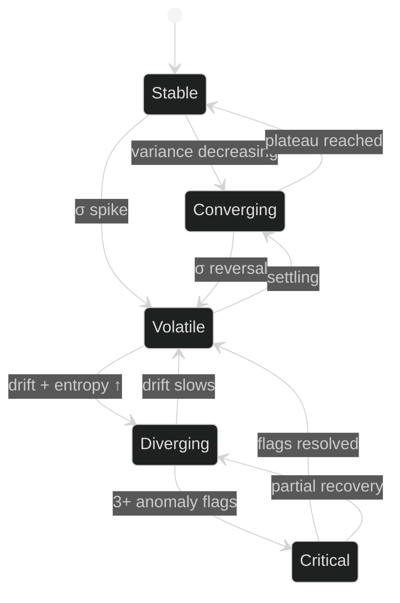

| State | Description |
|-------|-------------|
| 🟢 **Stable** | Low variance, consistent metrics across all temporal signals |
| 🔵 **Converging** | Decreasing variance, narrowing oscillation, approaching plateau |
| 🟡 **Volatile** | High variance in confidence or entropy, frequent direction changes |
| 🟠 **Diverging** | Accelerating drift combined with increasing entropy |
| 🔴 **Critical** | Three or more simultaneous anomaly flags from different subsystems |

### Alert Types (🔴 Phase V)

> Nine categories across three severity levels:

| Alert | Severity | Trigger |
|-------|:--------:|---------|
| `entropy_spike` | ⚠️ Warning | H(t) exceeds 2σ above mean |
| `entropy_collapse` | 🚨 Critical | H(t) drops below 2σ below mean |
| `confidence_collapse` | 🚨 Critical | C(t) drops below 2σ below mean |
| `confidence_surge` | ⚠️ Warning | C(t) exceeds 2σ above mean |
| `drift_acceleration` | ⚠️ Warning | d²d/dt² exceeds threshold |
| `drift_inflection` | ℹ️ Info | Sign change in acceleration |
| `tension_surge` | ⚠️ Warning | Contradiction tension spike |
| `stability_transition` | ℹ️ Info | State machine transition |
| `critical_state` | 🚨 Critical | Claim enters critical state |

---

## 🟥 Flow Diagrams

### Complete Data Pipeline

```mermaid
%%{init: {'theme': 'dark'}}%%
flowchart TB
    START(["🚀 python main.py --all"])

    subgraph COLLECT["🟢 PHASE I: COLLECT"]
        C1["Scrape Reddit\nWayback\nWeb Search"]
        C2["Query Gov DBs\nAcademic DBs"]
        C3["Analyze PDFs"]
        C4["Run Physics\nEngine"]
        C5["NLP Analysis"]
        C6["Pin to IPFS"]
    end

    subgraph SECURE["🔵 PHASE II: SECURE"]
        S1["Sign with\nEd25519"]
        S2["Merkle\nSnapshot"]
        S3["FOIA\nForensics"]
        S4["Generate\nAudit"]
    end

    subgraph MATH["🟡 PHASE III: MODEL"]
        M1["Parse\nEquations"]
        M2["Dimensional\nAnalysis"]
        M3["Build Claim\nGraph"]
    end

    subgraph SCORE["🟠 PHASE IV: SCORE"]
        SC1["Bayesian\nConfidence"]
        SC2["Mutation\nEntropy"]
        SC3["Citation\nDensity"]
        SC4["Contradiction\nMapping"]
    end

    subgraph TEMPORAL["🔴 PHASE V: TRACK"]
        T1["Confidence\nTimeline"]
        T2["Entropy\nTrend"]
        T3["Drift\nKinematics"]
        T4["Classify\nStability"]
        T5["Alert\nScan"]
    end

    subgraph INTEL["🟣 PHASE VI: INTELLIGENCE"]
        I1["Source\nReputation"]
        I2["Influence\nNetwork"]
        I3["Coordination\nDetection"]
        I4["Deep\nProvenance"]
        I5["Forensics\nReport"]
    end

    FINISH(["📊 Reports & Dashboard"])

    START --> COLLECT
    COLLECT --> SECURE
    SECURE --> MATH
    MATH --> SCORE
    SCORE --> TEMPORAL
    TEMPORAL --> INTEL
    INTEL --> FINISH

    style START fill:#0d1117,stroke:#58a6ff,color:#58a6ff
    style COLLECT fill:#0d2818,stroke:#2ea043,color:#7ee787
    style SECURE fill:#0d1b2e,stroke:#58a6ff,color:#79c0ff
    style MATH fill:#2e2a0d,stroke:#d29922,color:#e3b341
    style SCORE fill:#2e1a0d,stroke:#f0883e,color:#ffa657
    style TEMPORAL fill:#2e0d0d,stroke:#f85149,color:#ff7b72
    style INTEL fill:#1f0d2e,stroke:#a371f7,color:#d2a8ff
    style FINISH fill:#0d1117,stroke:#58a6ff,color:#58a6ff
```

### Scoring Cascade Flow

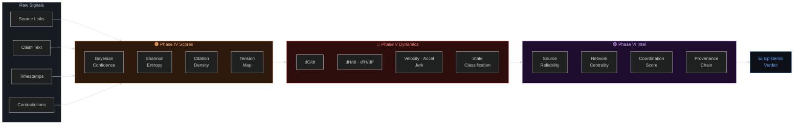

---

## ⬜ Testing

> **390 tests** · **10 test suites** · All passing

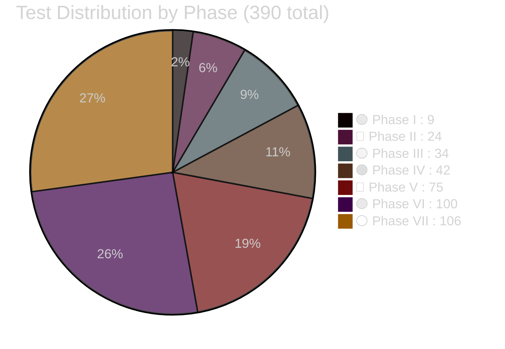

```bash
# Run full suite
python -m pytest tests/ -v                             # 390 tests

# Run by phase
python -m pytest tests/test_physics.py -v              # 🟢   9 tests — Physics engine
python -m pytest tests/test_phase2.py -v               # 🔵  24 tests — Crypto & integrity
python -m pytest tests/test_phase3.py -v               # 🟡  34 tests — Math & claim graph
python -m pytest tests/test_phase4.py -v               # 🟠  42 tests — Scoring engine
python -m pytest tests/test_phase5.py -v               # 🔴  75 tests — Temporal dynamics
python -m pytest tests/test_phase6.py -v               # 🟣 100 tests — Source intelligence
python -m pytest tests/test_phase7_math.py -v          # ⚪  40 tests — Math expansion
python -m pytest tests/test_phase7_anchor.py -v        # ⚪  14 tests — Blockchain anchoring
python -m pytest tests/test_phase7_registry.py -v      # ⚪  18 tests — Scientific registry
python -m pytest tests/test_phase7_performance.py -v   # ⚪  34 tests — Performance & optimization
```

All tests use `:memory:` SQLite via `PROJECT_ANCHOR_DB` environment variable.

---

## ⬜ IPFS Integration

The system integrates with a local **IPFS Kubo node** for immutable, content-addressed evidence storage:

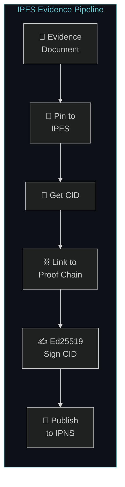

| Feature | Description |
|---------|-------------|
| **Proof Chain** | Each evidence item pinned to IPFS and linked into a DAG chain with tamper-evident CID references |
| **Content Addressing** | Every item gets a CID — a cryptographic hash. Any byte change produces a new CID |
| **SHA-256 Verification** | Independent SHA-256 hashes stored alongside CIDs for double verification |
| **IPNS Publishing** | Chain head published to IPNS for a stable, updatable reference |
| **Multi-Gateway** | Health checking and pinning across multiple IPFS gateways |

### Requirements

| Component | Endpoint |
|-----------|----------|
| IPFS Kubo (desktop or daemon) | Running locally |
| RPC API | `http://127.0.0.1:5001` |
| Gateway | `http://127.0.0.1:8081` |

### Workflow

```bash
python main.py --ipfs-status          # 1. Check node is online
python main.py --all                  # 2. Run research pipeline
python main.py --ipfs-archive         # 3. Archive everything to IPFS
python main.py --ipfs-verify          # 4. Verify proof chain integrity
python main.py --ipfs-pin doc.pdf     # 5. Pin a specific document
```

---

## ⬜ Operational Scope & Reproducibility

### Scope

This system is limited to:
- ✅ Publicly accessible data
- ✅ Public records & open-source intelligence
- ✅ Public academic databases

It does **not**:
- ❌ Access classified systems
- ❌ Bypass encryption
- ❌ Access restricted government networks

### Reproducibility Guarantees

| Guarantee | Mechanism |
|-----------|-----------|
| Source citation | All sources cited with URLs and timestamps |
| Audit trail | All operations logged with full audit trail |
| Portability | Self-contained SQLite database |
| Documentation | Physics equations and constants documented inline |
| Tamper evidence | Cryptographic signatures on all evidence |
| Integrity verification | Merkle snapshots verify database state |
| No API keys required | Basic operation works without external keys |

---

## ⬜ Quick Start

```bash
# Clone repository
git clone https://github.com/FTHTrading/Gravity-.git
cd Gravity-

# Install dependencies
pip install -r requirements.txt

# Initialize database
python main.py --init-db

# Run complete pipeline
python main.py --all

# Check system status
python main.py --claim-stats
```

---

## ⬜ Dependencies

**Python 3.11+** with:

| Package | Purpose |
|---------|---------|
| `requests` | HTTP client for API calls |
| `PyMuPDF` | PDF parsing and metadata extraction |
| `pdfminer.six` | PDF text extraction |
| `nltk` | Natural language processing |
| `scikit-learn` | TF-IDF vectorization, cosine similarity |
| `networkx` | Graph analysis, centrality, PageRank |
| `matplotlib` | Static chart generation |
| `plotly` | Interactive visualizations |
| `dash` | Web dashboard framework |
| `python-dateutil` | Date parsing and manipulation |
| `cryptography` | Ed25519 signatures (v46.0+) |
| `sympy` | Symbolic mathematics CAS (v1.14+) |
| `pytest` | Test framework |

---

<p align="center">
  <sub>Built with forensic precision. Every claim tracked. Every source measured. Every change recorded.</sub>
</p>
